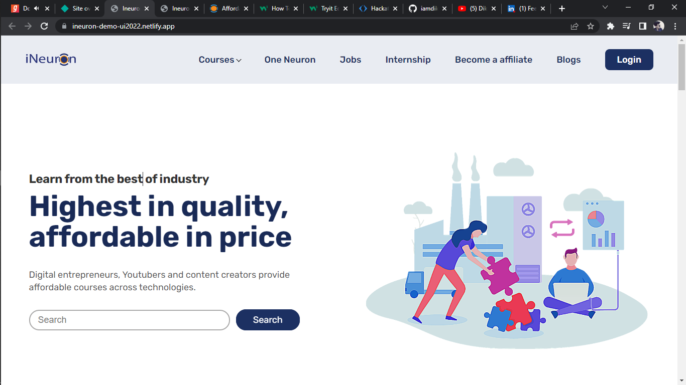
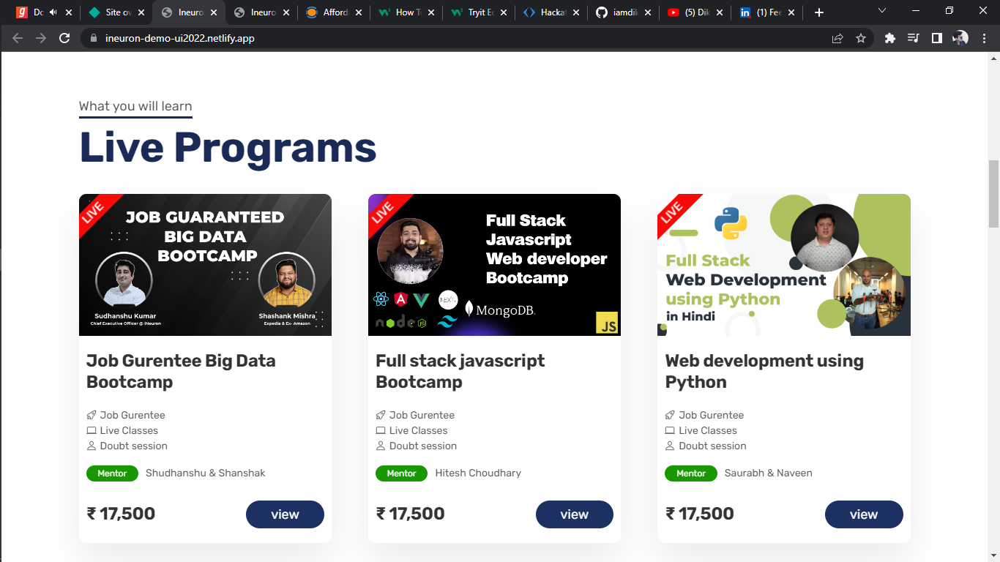
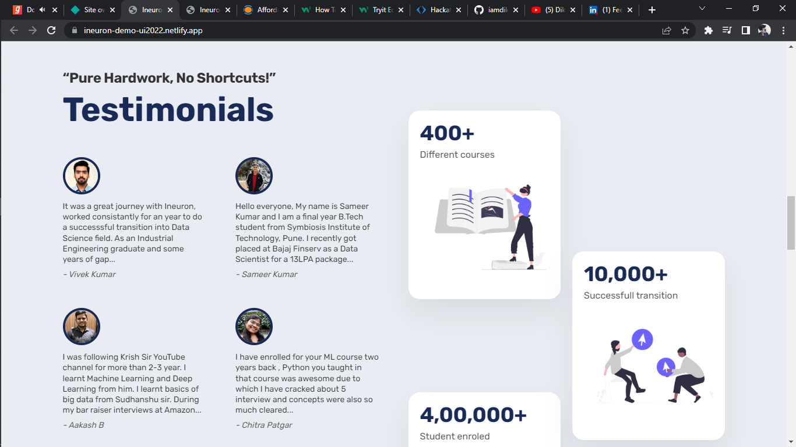

# Ineuron UI HACK-A-THON FSJS

[Project Live Link](https://ineuron-demo-ui2022.netlify.app/)

## Screenshot

## Technologies used?

    - HTML
    - CSS
    - JAVASCRIPT

## Time duration to build this project?

    - 3 Days

## How to run ?

    - Download zip file from github or use git to clone project in your computer system.
    - Open downloaded folder and go to index.html file
    - Double click on index.html icon.

## Find me on

 [Dikshit Bhardwaj](https://www.linkedin.com/in/dikshit-bhardwaj-8678b2191/)
